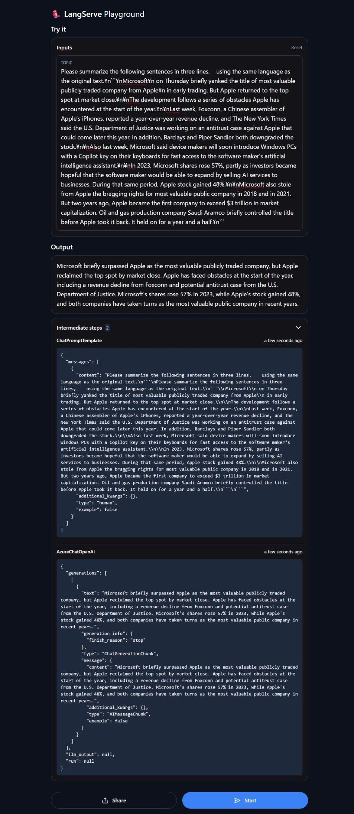

[](https://github.com/ks6088ts-labs/summarizer/actions/workflows/test.yml?query=branch%3Amain)
[](https://github.com/ks6088ts-labs/summarizer/actions/workflows/release.yml)

# summarizer

A summarizer service using Azure OpenAI Service

## Prerequisites

- [Python (3.10+)](https://www.python.org/downloads/) as a primary language
- [Poetry](https://python-poetry.org/docs/#installation) as a package manager
- [GNU Make](https://www.gnu.org/software/make/) as a task runner

## Usage

All tasks are defined in [Makefile](./Makefile).  
To see all tasks, run the following command.

```shell
$ make
ci-test                        run CI test
docker-build                   docker build
docker-run                     docker run
format                         format codes
info                           show info
install-deps                   install dependencies
jupyterlab                     run jupyterlab server
lint                           lint codes
server                         run server
test                           test codes
```

### Install dependencies

To install dependencies, just run the following command.

```shell
$ make install-deps
```

### Run CI test

To make sure that your code is working as expected, you should run CI test before committing your code.
To run the whole CI test, just run the following command.

```shell
$ make ci-test
```

This task is also executed on GitHub Actions (see [test.yml](./.github/workflows/test.yml)).

### Run server

To run API server, you need to set environment variables.

Create `*.env` files with reference to `*.env.sample` files.  
For example, just copy [azure_ai_search.env.sample](./azure_ai_search.env.sample) to `azure_ai_search.env` and edit it to fit your environment.

Then, run the following command to start API server.

```shell
$ make server
```

To call API, run the following command in another terminal.

````shell
# Call API from another terminal
$ curl 'http://localhost:8888/chat/invoke' \
  -H 'Content-Type: application/json' \
  --data-raw '{"input":{"topic":"Please summarize the following sentences in three lines,    using the same language as the original text.\n```\nMicrosoft\n on Thursday briefly yanked the title of most valuable publicly traded company from Apple\n in early trading. But Apple returned to the top spot at market close.\n\nThe development follows a series of obstacles Apple has encountered at the start of the year.\n\nLast week, Foxconn, a Chinese assembler of Apple’s iPhones, reported a year-over-year revenue decline, and The New York Times said the U.S. Department of Justice was working on an antitrust case against Apple that could come later this year. In addition, Barclays and Piper Sandler both downgraded the stock.\n\nAlso last week, Microsoft said device makers will soon introduce Windows PCs with a Copilot key on their keyboards for fast access to the software maker’s artificial intelligence assistant.\n\nIn 2023, Microsoft shares rose 57%, partly as investors became hopeful that the software maker would be able to expand by selling AI services to businesses. During that same period, Apple stock gained 48%.\n\nMicrosoft also stole from Apple the bragging rights for most valuable public company in 2018 and in 2021. But two years ago, Apple became the first company to exceed $3 trillion in market capitalization. Oil and gas production company Saudi Aramco briefly controlled the title before Apple took it back. It held on for a year and a half.\n```"},"config":{}}'

{"output":{"content":"Microsoft briefly took the title of most valuable publicly traded company from Apple, but Apple regained the top spot at market close. Apple has faced obstacles at the start of the year, including a revenue decline from Foxconn and the possibility of an antitrust case from the U.S. Department of Justice.\n\nMicrosoft announced that device makers will introduce Windows PCs with a Copilot key for fast access to the company's AI assistant. In 2023, Microsoft shares rose 57% and Apple stock gained 48%. Apple has held the title of most valuable public company, but briefly lost it to Saudi Aramco before regaining it.","additional_kwargs":{},"type":"ai","example":false},"callback_events":[],"metadata":{"run_id":"15877de6-e4bf-4b6a-bdc0-81d3a6a71b53"}}
````

Or you can call API from browser from http://localhost:8888/chat/playground/

[](http://localhost:8888/chat/playground/)

### Run notebook

To run notebook, run the following command.

```shell
$ make jupyterlab
```

### Run scripts

To run scripts, run the following command.

```shell
$ poetry run python scripts/azure_ai_search.py
add_texts response: ['NmQ4MTBjMjYtNDA2Yi00Y2RmLTg1MTgtNjVkYTEwM2VjZmQ0', 'ZjRkZWFhNTMtYTY0MS00NzMwLTk3YzEtYTdjNmI5MTNkOThl', 'ZDJhYmFkOTctNzVhZi00Y2E2LTk4ZWUtZDc4ZWM1N2FhNGQ0']
tag: basic, response, [Document(page_content='Test 3', metadata={'id': 'ZDJhYmFkOTctNzVhZi00Y2E2LTk4ZWUtZDc4ZWM1N2FhNGQ0', 'title': 'Title 3', 'source': 'B', 'random': '32893', 'tag': 'basic'}), Document(page_content='Test 1', metadata={'id': 'NmQ4MTBjMjYtNDA2Yi00Y2RmLTg1MTgtNjVkYTEwM2VjZmQ0', 'title': 'Title 1', 'source': 'A', 'random': '10290', 'tag': 'basic'})]
tag: advanced, response, [Document(page_content='Test 2', metadata={'id': 'ZjRkZWFhNTMtYTY0MS00NzMwLTk3YzEtYTdjNmI5MTNkOThl', 'title': 'Title 2', 'source': 'A', 'random': '48392', 'tag': 'advanced'})]
```
